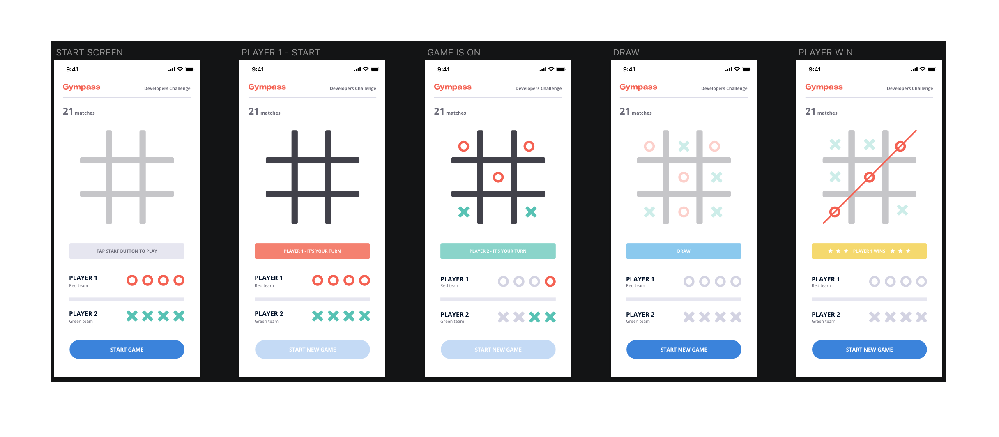

# Gympass Mobile test

## The game

A standard __Tic-Tac-Toe__ game is played on a __3 × 3__ grid by 2 players named Player 1 and Player 2 (where Player 1 always moves first). During gameplay, players take alternating turns in which they claim a cell by filling it with their assigned character (i.e., O or X). Player 1 is always O and Player 2 is always X. The first character to claim 3 cells that fall in a vertical, horizontal, or diagonal line wins.

## The Project

Build a Tic-Tac-Toe app using **React Native**, you can start with a simple `react-native init` with the following functionality:

- The game ends under either of the following circumstances:
  -  A player wins by claiming 3 cells that fall in a horizontal, vertical, or diagonal line.
  - The players tie if there are no more possible moves (i.e., all cells are claimed).

- It must have a button at the bottom of the screen whose function is to start a new game. If no game is currently in progress, this button must be labeled Start New Game, if there is a game in progress, this button must be labeled Restart Game.

- When the game ends, display the result in the text box immediately above the Start New Game button.
  - If Player 1 wins, display Player 1 Wins.
  - If Player 2 wins, display Player 2 Wins.
  - If the players tie, display It's a Tie.

- In the right corner of the top bar, display the number of games thus user finished. 
  - This number should be kept if the user finishes the app and start it again

- If the user clicks on the Restart Game, a dialog box should appear with the message: Do you want to restart the game?.
  - If the user clicks OK, a new game starts. This means the game board reverts its initial state and all claimed cells are cleared.
  - If the user clicks CANCEL, the dialog box closes and the current game resumes.

## Bonus Tasks
- Redux, if you find it necessary
- Animations are welcome! 🤩
- Code linting (ESLint)
- Tests

# Delivery
- **Don't** fork this project. Create a new repository in your account and send us the URL;
- Create a readme file with the instructions to run the project and the tests, and add any comment that you think is relevant.

Thanks and good luck! 🍀 
